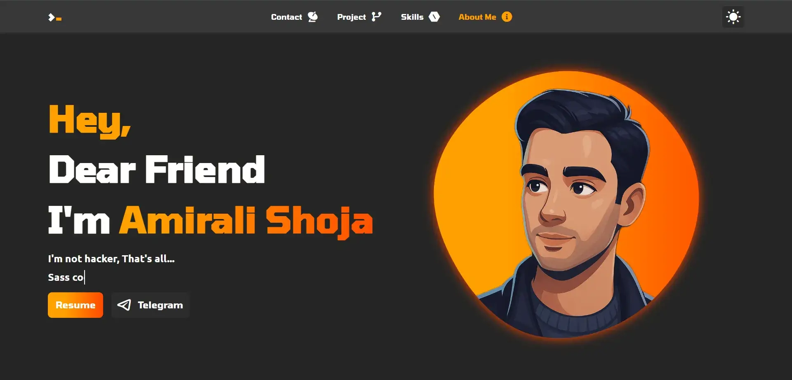

# 📀 Portfolio Project

Hello and welcome to this repository, there is Portfolio landing project that i made it for myself to show my skills and my project in a web landing, and i'm happy to tell you you can fork it and made own portfolio landing; absolutty you need to change some things, so see layoutVar in variable folder in scripts folder and change every thing you want. just make sure you have make dist version yourself because this project don't make dist version automatically.

- Perfect Design
- Responsive
- Accessible
- Dark Mode
- Also you can fork it and change somethings to made it for yourself.

**check it out :** [Demo](https://amiralishoja.github.io/PortfolioLandingProject/dist/)

## ⚙️ Technologies Covered

- **Html**
- **Css**
- **Java Script**
- **Git Flow**

## 📡 Social Media

Connect with me:

## 📬 Feedback

Have suggestions or feedback? Reach out at [amiralishoja.info@gmail.com](mailto:amiralishoja.info@gmail.com).